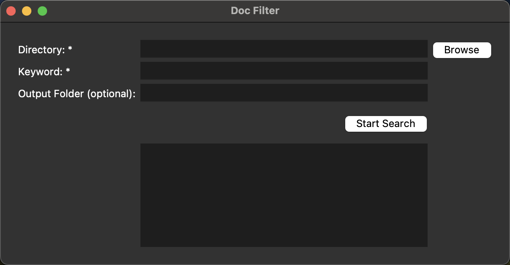

# **Doc Filter**

**Doc Filter** is a Python script that scans `.doc` files for a specified keyword and moves matching files to a designated folder.


## **Features**
- **Bulk Processing** – Scans multiple `.doc` files at once.
- **Keyword Search** – Searches for a specified keyword (case-insensitive).
- **Automated File Management** – Moves matching files to a new directory.
- **Customizable Output Folder** – Allows specifying a custom folder name.
- **Optimized for macOS** – Utilizes `antiword` for efficient document parsing.
- **Designed for Large Collections** – Handles large volumes of documents effectively.


## **Installation**


### **Option 1 : Install via Release**
1. Go to the Releases page and download the release archive.
2. Extract the archive to your desired location.
3. If you're on macOS, simply double-click on script.app to launch the application.
### **Option 2 : Install via Git Clone**
Ensure you have **Python 3.x**   installed on your system: 
```bash
   brew install python
```
### **Steps**
1. **Clone the repository:**
  ```bash
  git clone git@github.com:Dina-Mechraoui/doc-keyword-filter.git
  cd doc-keyword-filter
```
2. **Run the application:**
  ```bash
  python script.py
  ```


## **Usage**
1. Launch the Application
2. Select a Directory (files with .doc)
3. Enter a Keyword
4. click the 'Start Search' button

## **Screenshot of the App**



## **Future Improvements**
- Extend support to `.docx` files.
- Expand compatibility to Windows and Linux.

## **🤝 Contributing**
Contributions are welcome! If you'd like to suggest improvements, report issues, or contribute code, please feel free to **open an issue** or **submit a pull request**.
